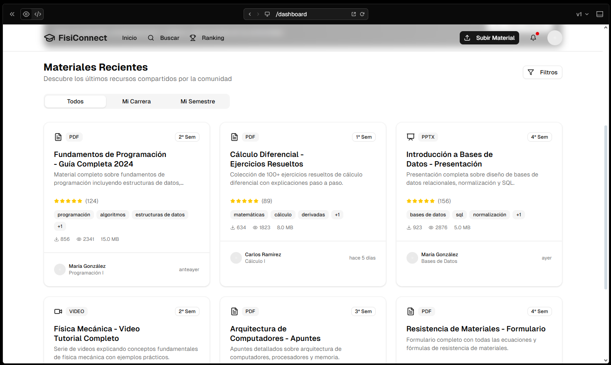

# 🎨 Mockups de Interfaces de Usuario - FisiConnect

Prototipos visuales de las pantallas principales del sistema, utilizados durante la recopilación y validación de requisitos.

---

## 📱 Interfaces Principales

### **Mockup 01: Inicio de Sesión**

**Elementos principales:**
- Formulario de login con email y contraseña
- Enlace a registro de nuevo usuario
- Validación visual de campos
- Diseño limpio y centrado

**Requisito asociado:** RFM-001 - Autenticación de Usuarios

---

### **Mockup 02: Dashboard Principal**

**Elementos principales:**
- Barra de navegación superior
- Barra de búsqueda prominente
- Grid de materiales recientes
- Filtros laterales visibles
- Paginación de resultados

**Requisito asociado:** RFM-009 - Dashboard Principal

---

### **Mockup 03: Búsqueda de Materiales**

**Elementos principales:**
- Filtros múltiples (carrera, semestre, asignatura, tipo)
- Resultados en tarjetas organizadas
- Opciones de ordenamiento
- Contadores de resultados

**Requisito asociado:** RFM-003 - Búsqueda y Filtrado

---

### **Mockup 04: Detalle de Material**

**Elementos principales:**
- Metadata completa del material
- Botón de descarga destacado
- Sistema de calificación con estrellas
- Lista de comentarios y reseñas
- Estadísticas (descargas, vistas)

**Requisitos asociados:** RFM-004 (Visualización), RFM-005 (Calificaciones), RFM-006 (Comentarios)

---

### **Mockup 05: Subir Material**

**Elementos principales:**
- Zona de arrastre de archivos (drag & drop)
- Validación de tipo y tamaño
- Campos de metadata (título, descripción, carrera, asignatura, semestre)
- Vista previa del archivo
- Botón de confirmación

**Requisito asociado:** RFM-002 - Gestión de Materiales

---

### **Mockup 06: Perfil de Usuario**

**Elementos principales:**
- Información personal (nombre, carrera, semestre, avatar)
- Estadísticas de contribución:
  - Materiales subidos
  - Descargas recibidas
  - Vistas totales
  - Calificación promedio
- Puntos y posición en ranking
- Sección "Mis materiales"

**Requisito asociado:** RFM-007 - Perfil de Usuario

---

### **Mockup 07: Leaderboard**

**Elementos principales:**
- Top 50 usuarios ordenados por puntos
- Información: nombre, carrera, puntos, rank
- Indicador visual de posición
- Diseño tipo tabla organizada

**Requisito asociado:** RFM-008 - Sistema de Gamificación

---

**Elaborado por:** Equipo ED06 - FisiConnect  
**Fecha:** Noviembre 2025

