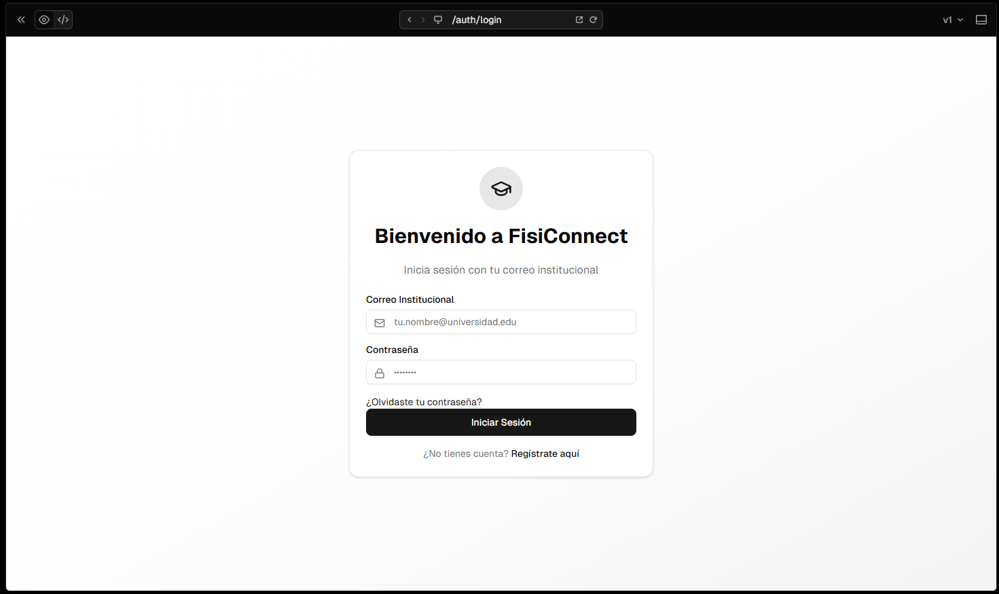
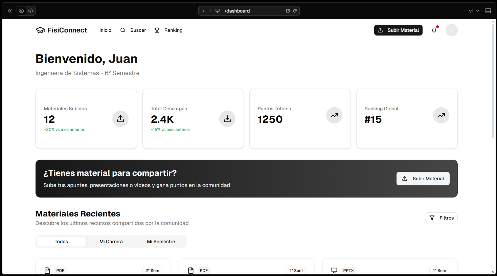
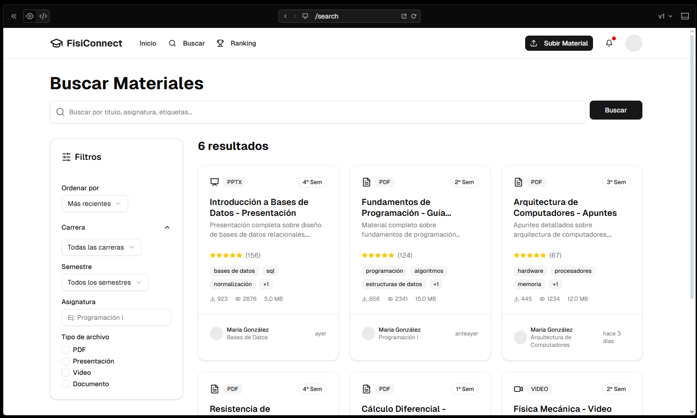
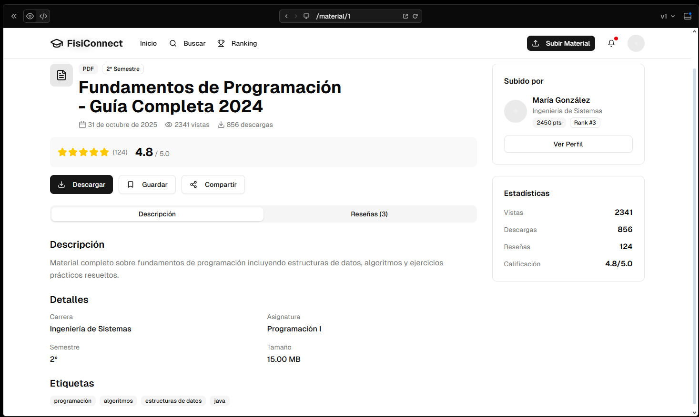
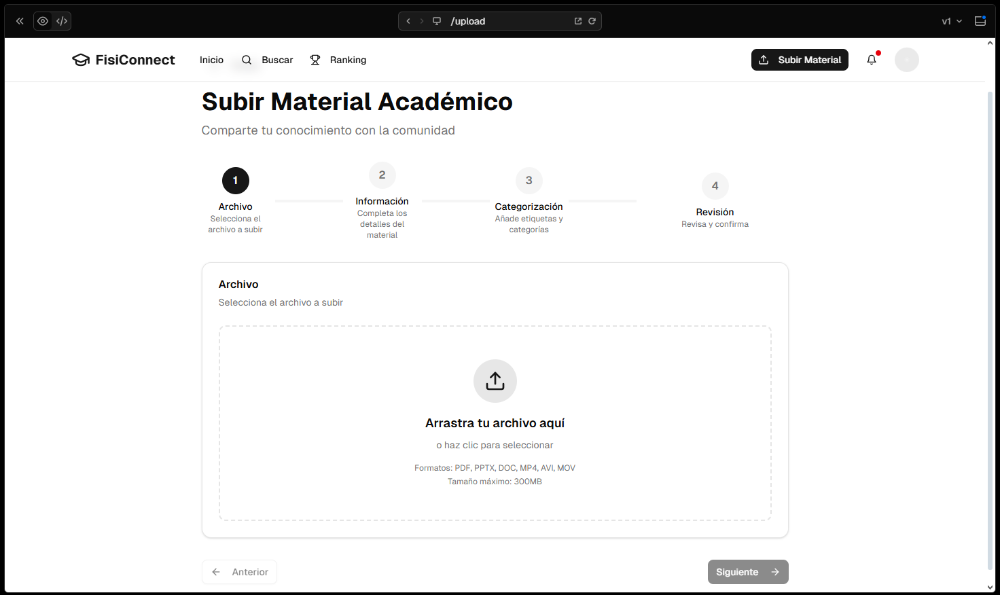
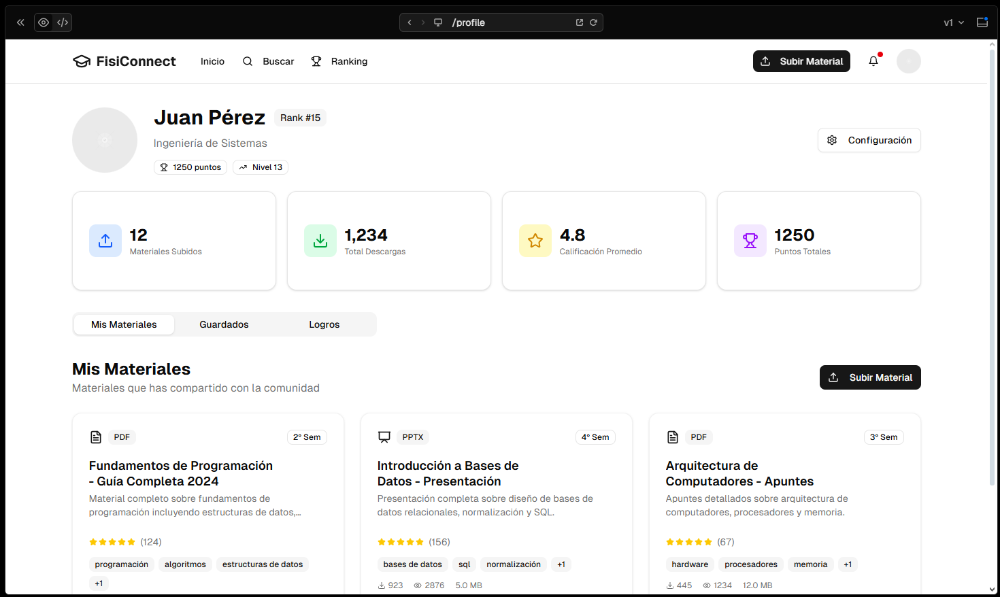

# Mockups de Interfaces - FisiConnect v0

> **Nota de Desarrollo**: Los mockups presentados en esta sección fueron creados utilizando herramientas de IA (Inteligencia Artificial) mediante prompts específicos definidos por el equipo de desarrollo ED06. Los diseños fueron generados basándose en los requisitos funcionales y casos de uso establecidos en la Guía 01, representando fielmente la visión del proyecto FisiConnect.

## Prototipos de Interfaz de Usuario (Desarrollados con IA)

### **Mockup 01: Inicio de Sesión**

*Interfaz de autenticación con validación de correo UNMSM*

### **Mockup 02: Página de Inicio**

*Página de inicio con materiales destacados y accesos rápidos*

### **Mockup 03: Materiales Recientes**

*Listado de materiales organizados por fecha de publicación*

### **Mockup 04: Búsqueda de Materiales**

*Sistema de búsqueda con filtros múltiples y resultados*

### **Mockup 05: Detalle de Material**

*Página de material específico con comentarios y calificaciones*

### **Mockup 06: Subir Materiales**

*Interfaz de carga de materiales con validación de archivos*

### **Mockup 07: Perfil de Usuario**

*Dashboard personal con estadísticas e insignias*

---

> **Nota del Equipo ED06**: El uso de IA en esta fase nos permitió acelerar el proceso de diseño manteniendo la coherencia técnica con los requisitos establecidos. Estos mockups servirán como base para el desarrollo frontend del prototipo funcional.

*Equipo ED06 - FisiConnect*
