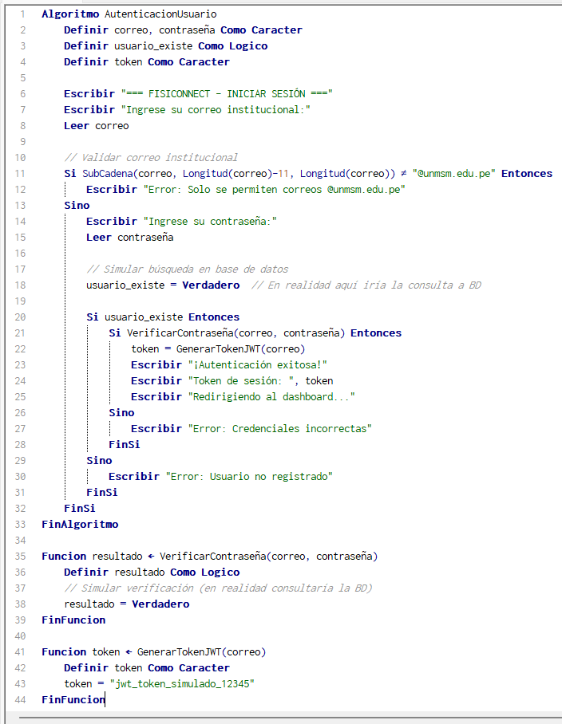
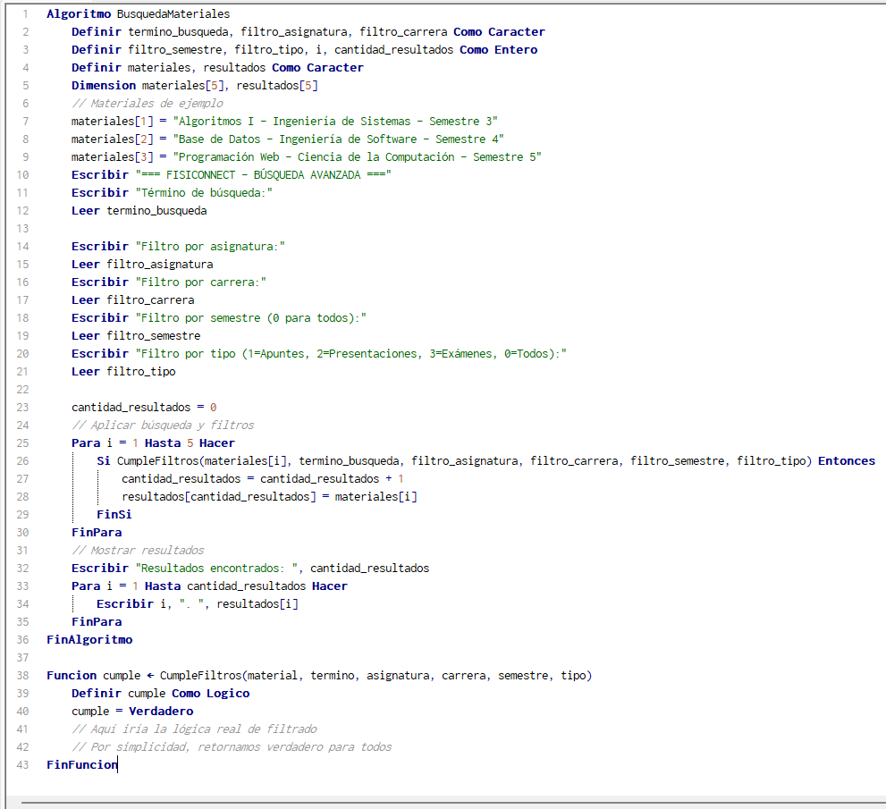
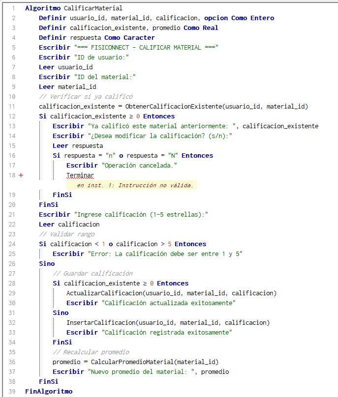
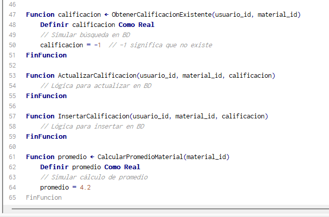

# Pseudocódigos - Requisitos Funcionales Mandatorios

## 🔐 Pseudocódigos Desarrollados en PSeInt

### **Pseudocódigo 01: Autenticación de Usuario**

*Algoritmo de autenticación con validación de correo institucional UNMSM*

### **Pseudocódigo 02: Búsqueda Avanzada de Materiales**  

*Sistema de búsqueda con filtros múltiples y procesamiento de resultados*

### **Pseudocódigo 03: Sistema de Calificaciones**

*Algoritmo de calificación y cálculo de promedios para materiales académicos*

---

**Nota**: Estos pseudocódigos representan la lógica fundamental de los requisitos mandatorios más críticos del sistema FisiConnect.

*Equipo ED06 - FisiConnect*