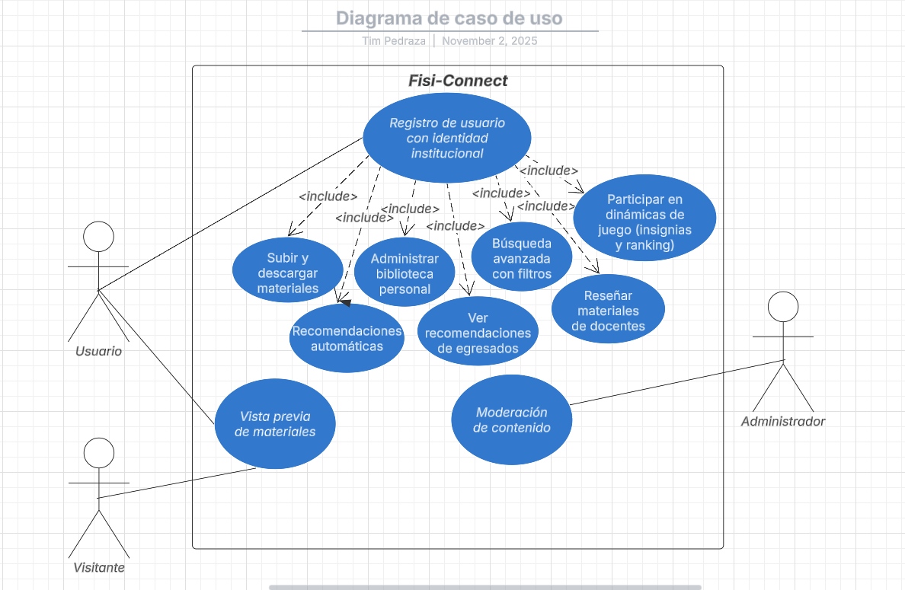

# Diagrama de Casos de Uso - FisiConnect

## 📊 Diagrama General de Casos de Uso

*Diagrama UML de casos de uso que representa las funcionalidades principales del sistema FisiConnect*

---

## Documentación de Casos de Uso

### **Caso de Uso: Registro de Usuario con Identidad Institucional**

**ID:** CU-001  
**Actor:** Estudiante FISI  
**Descripción:** Permite el registro de nuevos usuarios mediante validación de correo institucional UNMSM  
**Precondiciones:** El usuario debe tener correo institucional @unmsm.edu.pe activo  

**Flujo Principal:**
1. El usuario accede al formulario de registro
2. Ingresa su correo institucional UNMSM
3. El sistema valida el formato del correo
4. El sistema envía correo de verificación
5. El usuario confirma su cuenta mediante el enlace
6. El sistema activa la cuenta y redirige al dashboard

**Reglas de Negocio:**
- RN-001: Solo se aceptan correos con dominio @unmsm.edu.pe
- RN-002: Cada correo solo puede registrar una cuenta

---

### **Caso de Uso: Subir Materiales Académicos**

**ID:** CU-002  
**Actor:** Usuario registrado  
**Descripción:** Permite a usuarios autenticados subir materiales académicos a la plataforma  
**Precondiciones:** Usuario debe haber iniciado sesión  

**Flujo Principal:**
1. El usuario selecciona "Subir material"
2. Completa formulario con metadatos (título, descripción, categoría)
3. Selecciona archivo desde su dispositivo
4. El sistema valida formato y tamaño del archivo
5. El usuario confirma la publicación
6. El sistema almacena el material y notifica éxito

**Reglas de Negocio:**
- RN-003: Formatos permitidos: PDF, PPTX, DOCX, XLSX, MP4, XLS
- RN-004: Tamaño máximo por archivo: 50 MB
- RN-005: Metadatos obligatorios: título, categoría, descripción, carrera, semestre

---

### **Caso de Uso: Descargar Materiales**

**ID:** CU-003  
**Actor:** Usuario registrado  
**Descripción:** Permite descargar materiales académicos disponibles en la plataforma  
**Precondiciones:** Usuario autenticado, material disponible  

**Flujo Principal:**
1. El usuario busca material mediante filtros
2. Selecciona material de interés
3. Visualiza detalles y vista previa
4. Haz clic en "Descargar"
5. El sistema registra la descarga
6. El archivo se descarga al dispositivo

**Reglas de Negocio:**
- RN-006: Se registra estadística de descargas por material

---

> **Nota del Equipo ED06**: Los casos de uso documentados representan las interacciones fundamentales entre los usuarios y el sistema FisiConnect, asegurando que todos los requisitos funcionales identificados en la Guía 01 estén adecuadamente cubiertos en el diseño del sistema.

**Elaborado por:** Equipo ED06 - FisiConnect  
**Fecha:** Noviembre 2025