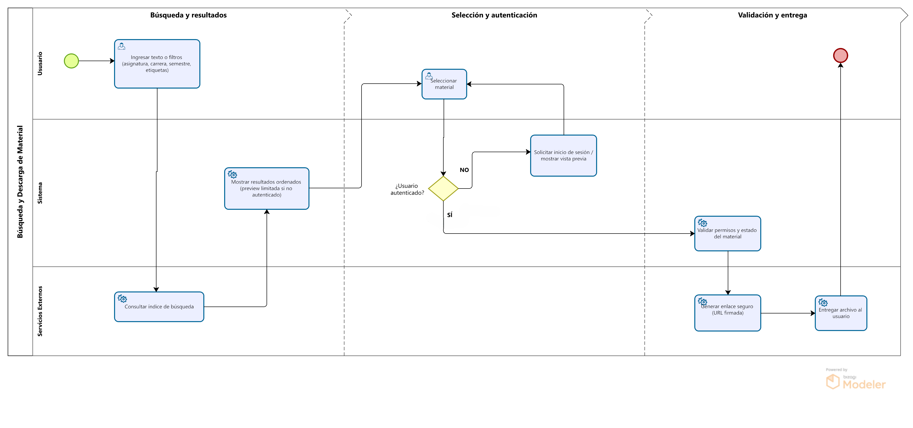

# Diagrama de Procesos - FisiConnect

## Procesos Principales Modelados

### **Diagrama 01: Registro de Usuario**

*Flujo completo del proceso de registro y validación institucional*

**Descripción**:
Proceso que gestiona el registro de nuevos usuarios en FisiConnect, incluyendo validación de correo institucional UNMSM, verificación de datos y activación de cuenta mediante confirmación por email.

### **Diagrama 02: Subida de Materiales**

*Flujo de carga y validación de nuevos materiales académicos*

**Descripción**:
Proceso que especifica los pasos para la carga de nuevos materiales, incluyendo validación de formatos, metadatos obligatorios, revisión de contenido y publicación en la plataforma.

### **Diagrama 03: Descarga de Materiales**

*Flujo de búsqueda, selección y descarga de recursos académicos*

**Descripción**:
Proceso que detalla el flujo completo de búsqueda de materiales académicos, incluyendo filtros avanzados, visualización de detalles, verificación de permisos y descarga segura de archivos.

---

> **Nota del Equipo ED06**: Los diagramas fueron desarrollados en Bizagi Modeler siguiendo el estándar BPMN 2.0, asegurando claridad y precisión en la representación de los procesos críticos de FisiConnect.

*Equipo ED06 - FisiConnect*

