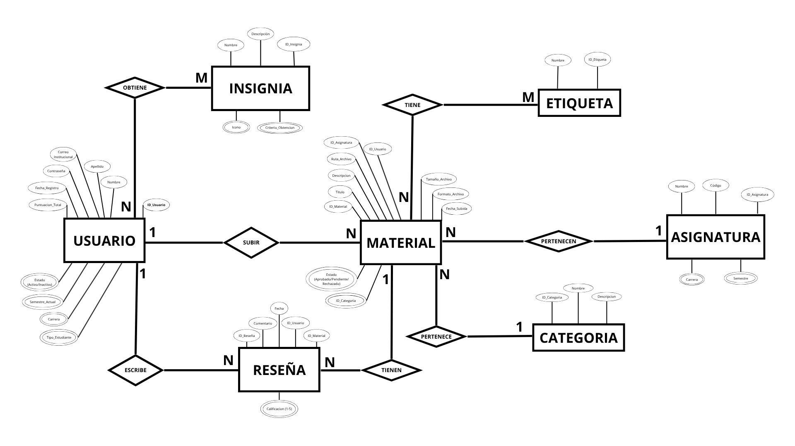

# Modelo Conceptual de Datos - FisiConnect

## Modelo Entidad-Relación

### **Diagrama del Modelo ER**

*Diagrama Entidad-Relación que representa la estructura completa de datos del sistema FisiConnect*

[Descargar modelo ER en PDF](../../assets/recursos/ED06_ModeloER.pdf)

---

## Descripción del Modelo Conceptual

### **Entidades Principales**

#### **USUARIO**
Almacena información de los estudiantes registrados en la plataforma
- **Atributos**: 
  - `ID_Usuario` (PK)
  - `Correo_Institucional`
  - `Contraseña`
  - `Nombre`
  - `Apellido`
  - `Tipo_Estudiante`
  - `Carrera`
  - `Semestre_Actual`
  - `Puntuacion_Total`
  - `Estado` (Activo/Inactivo)
  - `Fecha_Registro`

#### **MATERIAL**
Representa los recursos académicos compartidos en la plataforma
- **Atributos**:
  - `ID_Material` (PK)
  - `Titulo`
  - `Descripcion`
  - `Ruta_Archivo`
  - `Formato_Archivo`
  - `Tamaño_Archivo`
  - `Fecha_Subida`
  - `Estado` (Aprobado/Pendiente/Rechazado)
  - `ID_Categoria` (FK)
  - `ID_Asignatura` (FK)
  - `ID_Usuario` (FK)

#### **CATEGORIA**
Organiza los materiales en categorías temáticas
- **Atributos**:
  - `ID_Categoria` (PK)
  - `Nombre`
  - `Descripcion`

#### **ASIGNATURA**
Gestiona las asignaturas académicas de la FISI
- **Atributos**:
  - `ID_Asignatura` (PK)
  - `Nombre`
  - `Código`
  - `Semestre`
  - `Carrera`

#### **RESEÑA**
Almacena las calificaciones y comentarios sobre materiales
- **Atributos**:
  - `ID_Reseña` (PK)
  - `Comentario`
  - `Calificacion` (1-5)
  - `Fecha`
  - `ID_Material` (FK)
  - `ID_Usuario` (FK)

#### **ETIQUETA**
Sistema de etiquetado para búsqueda avanzada
- **Atributos**:
  - `ID_Etiqueta` (PK)
  - `Nombre`

#### **INSIGNIA**
Sistema de gamificación con logros y recompensas
- **Atributos**:
  - `ID_Insignia` (PK)
  - `Nombre`
  - `Descripción`
  - `Icono`
  - `Criterio_Obtencion`

---

## Relaciones y Cardinalidades

### **Relaciones 1:N (Uno a Muchos)**
- **USUARIO** → **MATERIAL** (1:N) - Un usuario sube muchos materiales
- **USUARIO** → **RESEÑA** (1:N) - Un usuario escribe muchas reseñas
- **CATEGORIA** → **MATERIAL** (1:N) - Una categoría contiene muchos materiales
- **ASIGNATURA** → **MATERIAL** (1:N) - Una asignatura tiene muchos materiales

### **Relaciones M:N (Muchos a Muchos)**
- **MATERIAL** ↔ **ETIQUETA** (M:N) - Un material tiene muchas etiquetas, una etiqueta está en muchos materiales
- **USUARIO** ↔ **INSIGNIA** (M:N) - Un usuario obtiene muchas insignias, una insignia es obtenida por muchos usuarios

### **Metadatos del Modelo:**
| Aspecto | Detalle |
|---------|---------|
| **Entidades** | 7 entidades principales |
| **Relaciones** | 8 relaciones definidas |
| **Atributos** | 30+ atributos mapeados |
| **Cardinalidades** | 1:N y M:N especificadas |
| **Claves** | Primarias y foráneas identificadas |

---

## 📊 Estructura de Base de Datos

El modelo ER presentado se implementará en **PostgreSQL** con las siguientes consideraciones:
- Índices en campos de búsqueda frecuente
- Triggers para actualización de puntuaciones
- Constraints de integridad referencial
- Backup automático de datos

---

> **Nota del Equipo ED06**: El modelo Entidad-Relación establece los cimientos sólidos para la base de datos de FisiConnect, garantizando coherencia completa con los requisitos funcionales y casos de uso definidos. La estructura permite el crecimiento escalable del sistema mientras mantiene la integridad de los datos académicos.

*Equipo ED06 - FisiConnect*