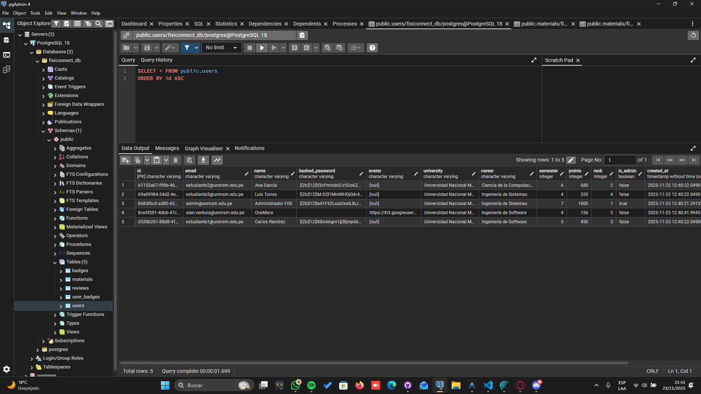

# 🗄️ Modelo Lógico-Físico de Datos - FisiConnect

Esquema de base de datos PostgreSQL con las tablas, relaciones e índices para FisiConnect.

---

## 📋 Tablas Principales

### **users**
- id (UUID, PK)
- email (VARCHAR, UNIQUE)
- name, hashed_password, career, semester
- points (INTEGER) - Para gamificación
- avatar, created_at, updated_at

**Índices:** email, points

---

### **materials**
- id (UUID, PK)
- title, description, type (pdf, pptx, video, doc)
- file_url, file_size, career, subject, semester
- rating (FLOAT), review_count, downloads, views
- user_id (FK → users)
- uploaded_at, updated_at

**Índices:** user_id, career, subject, rating, downloads

---

### **reviews**
- id (UUID, PK)
- rating (1-5), comment, helpful_count
- user_id (FK → users), material_id (FK → materials)
- created_at

**Constraint:** UNIQUE(user_id, material_id)

---

## 🔗 Relaciones

users (1) → (N) materials
users (1) → (N) reviews
materials (1) → (N) reviews

---

## 📊 Diagrama Entidad-Relación Físico

*Esquema de base de datos con tablas, columnas, tipos de datos, relaciones e índices para FisiConnect.*

---

**Elaborado por:** Equipo ED06 - FisiConnect  
**Fecha:** Noviembre 2025

