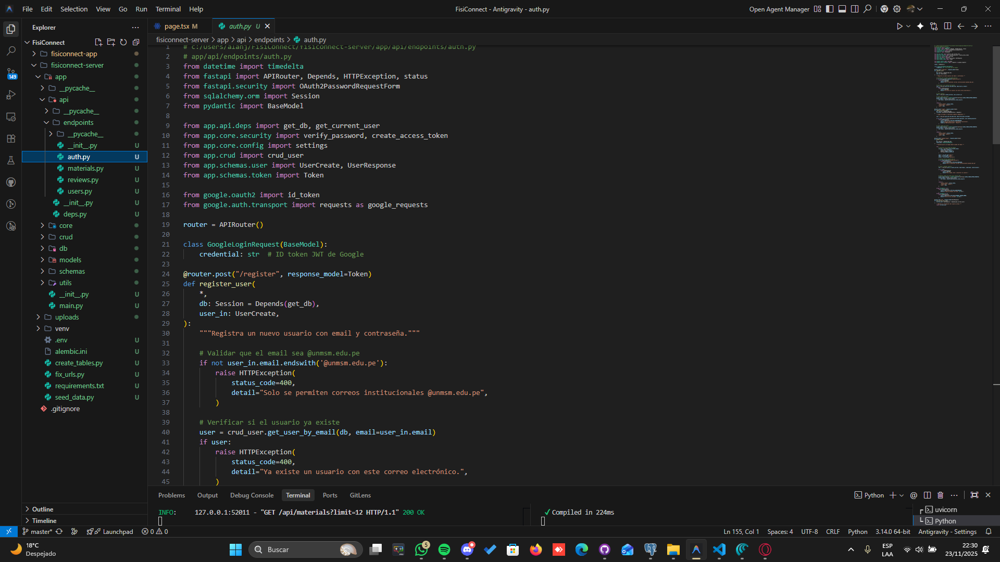
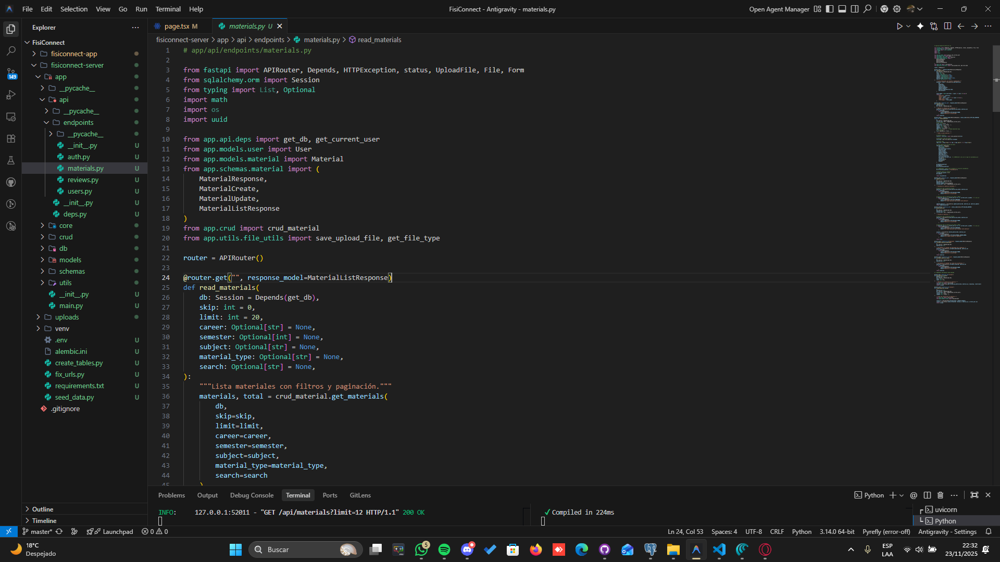
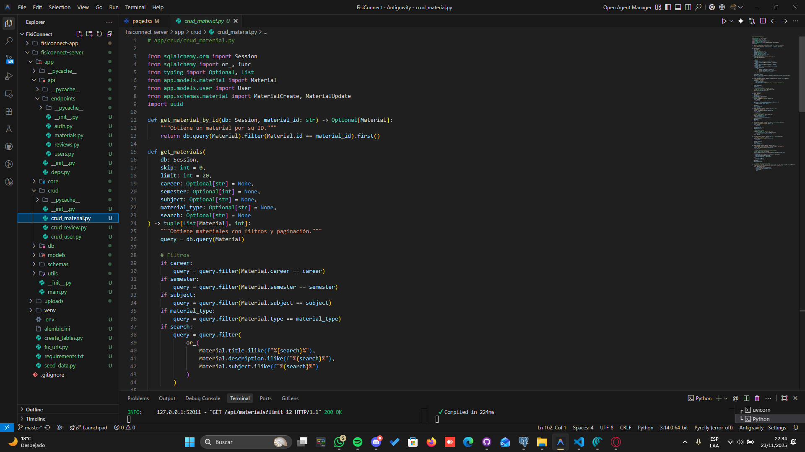
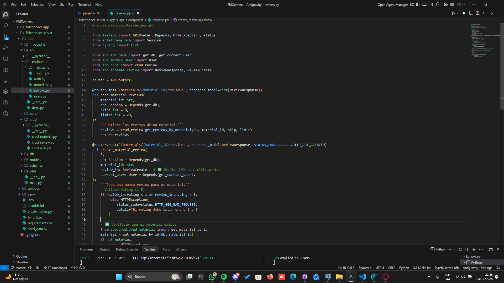
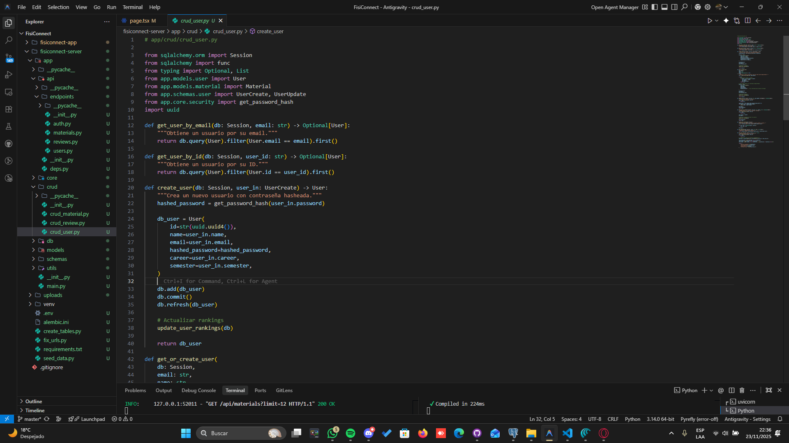
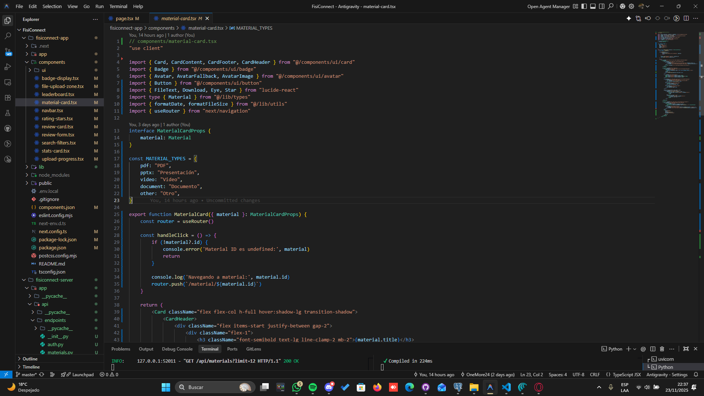
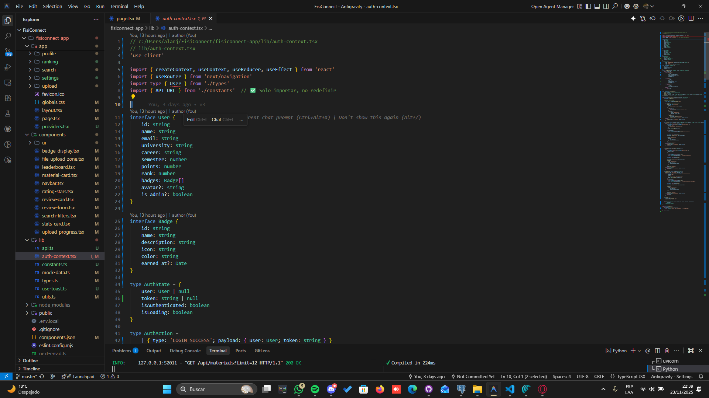

# 💾 Código Fuente - FisiConnect

Código fuente de las funciones más importantes del sistema, organizadas por módulo.

---

## 📸 Capturas de Código Principal

### **1. Autenticación - Registro de Usuario (Backend)**
**Archivo:** `backend/app/routers/auth.py`

**Funcionalidad:**
- Validación de email único
- Hashing de contraseña con bcrypt
- Creación de usuario en base de datos
- Generación de token JWT

---

### **2. Subida de Material (Backend)**
**Archivo:** `backend/app/routers/materials.py`

**Funcionalidad:**
- Validación de tipo y tamaño de archivo
- Almacenamiento con UUID único
- Guardado de metadata en BD
- Asignación de +50 puntos al usuario

---

### **3. Búsqueda con Filtros (Backend)**
**Archivo:** `backend/app/crud/crud_material.py`

**Funcionalidad:**
- Query dinámico según filtros
- Búsqueda por texto en título/descripción
- Filtros: carrera, semestre, asignatura, tipo
- Paginación de resultados

---

### **4. Sistema de Calificaciones (Backend)**
**Archivo:** `backend/app/routers/reviews.py`

**Funcionalidad:**
- Validar usuario autenticado
- Restricción: una reseña por usuario
- Cálculo de promedio ponderado
- Asignación de puntos (+10 si rating ≥ 4)

---

### **5. Ranking de Usuarios (Backend)**
**Archivo:** `backend/app/crud/crud_user.py`

**Funcionalidad:**
- Ordenar usuarios por puntos (DESC)
- Calcular posición (rank)
- Limitar a top 50
- Devolver con datos relevantes

---

### **6. Componente de Material Card (Frontend)**
**Archivo:** `frontend/src/components/material-card.tsx`

**Funcionalidad:**
- Renderizar tarjeta de material
- Mostrar rating con estrellas
- Enlace a página de detalle
- Diseño responsive con Tailwind CSS

---

### **7. Context de Autenticación (Frontend)**
**Archivo:** `frontend/src/contexts/auth-context.tsx`

**Funcionalidad:**
- Gestión de estado de autenticación
- Guardar/recuperar token JWT
- Login y logout
- Protección de rutas

---

**Elaborado por:** Equipo ED06 - FisiConnect  
**Fecha:** Noviembre 2025