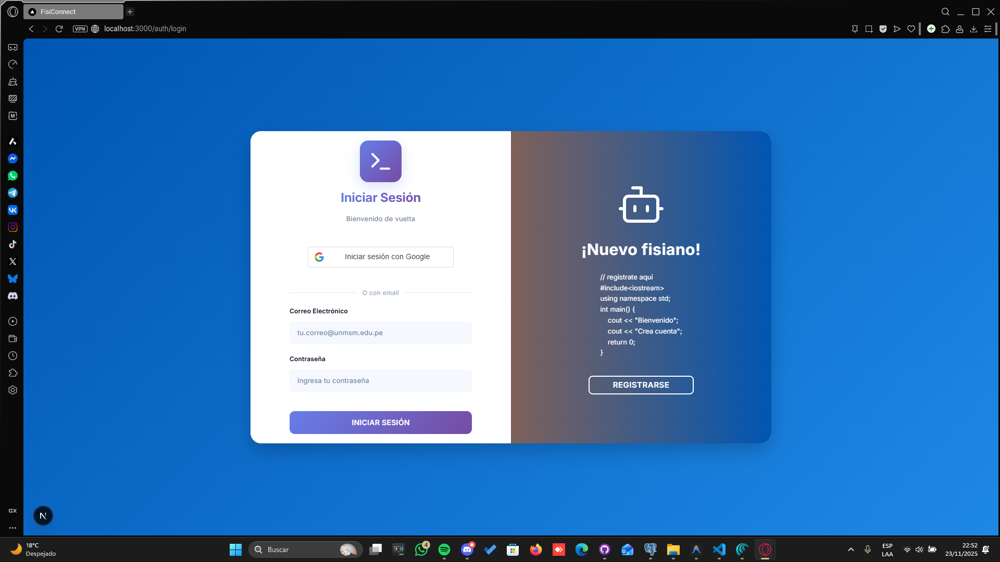
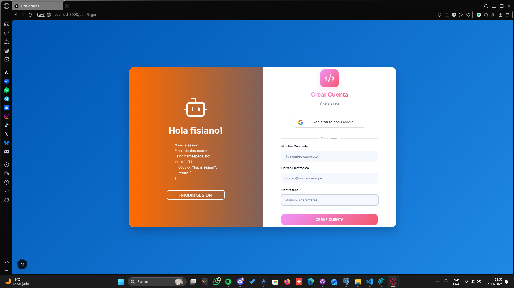
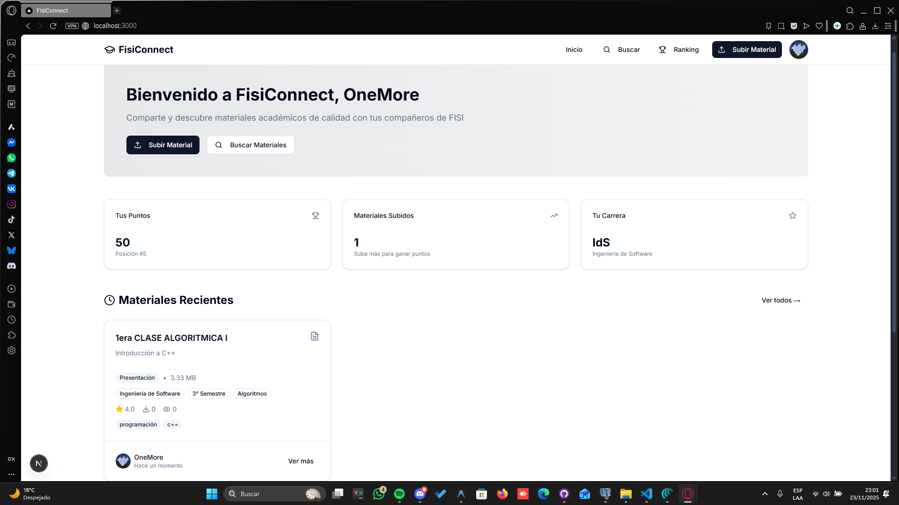
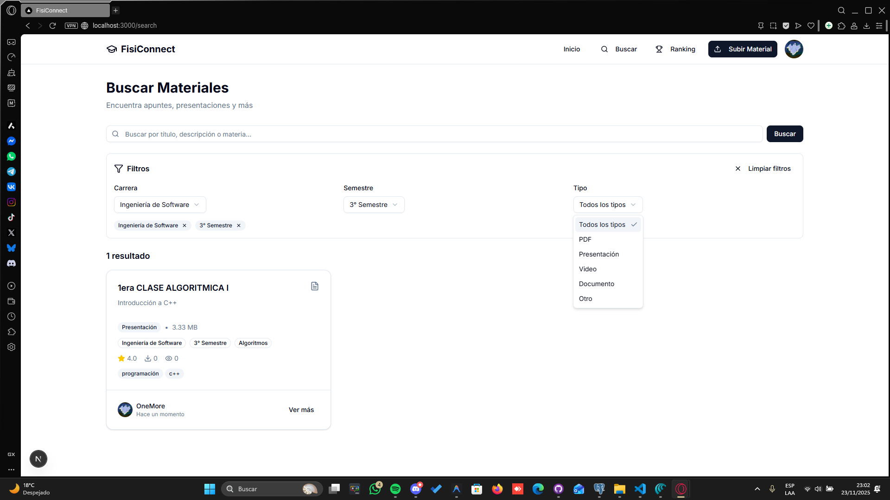
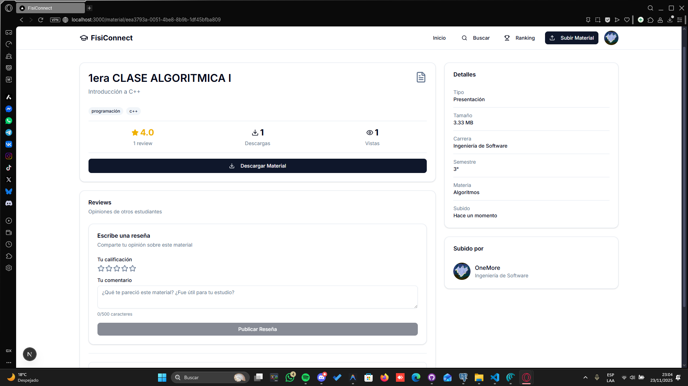
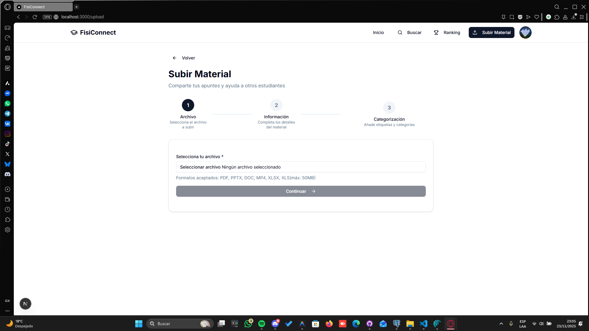
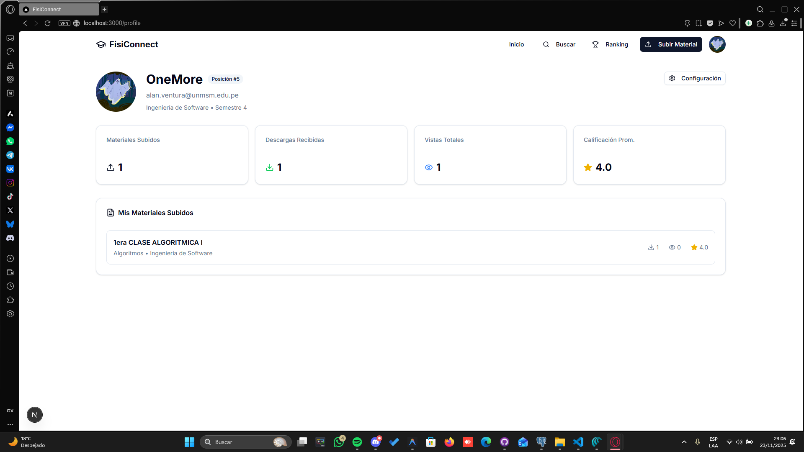
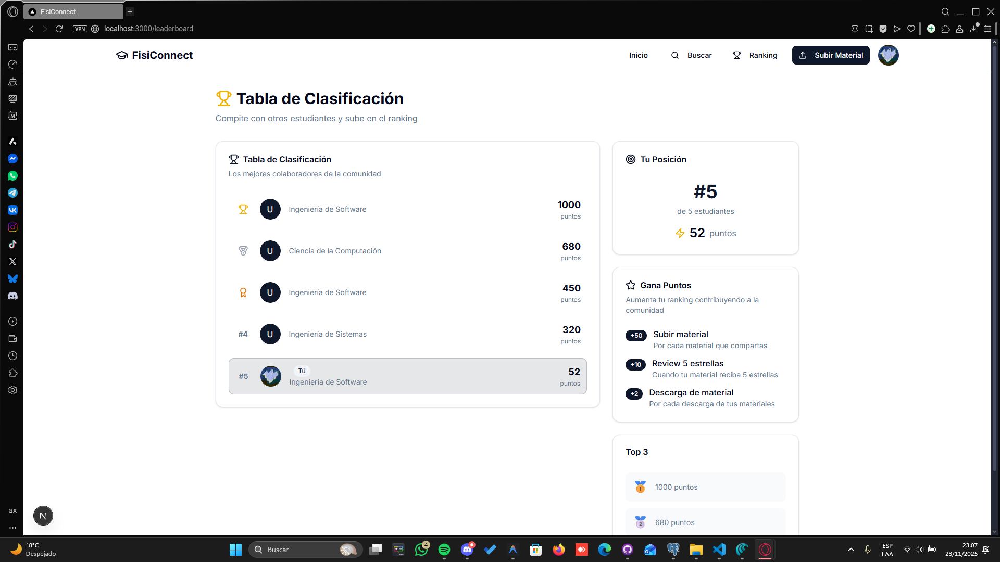

# 📱 Pantallas de Interfaz de Usuario - FisiConnect

Capturas de pantalla del prototipo funcional mostrando todas las interfaces principales del sistema.

---

## 🖥️ Pantallas Principales

### **1. Página de Login**

**Ubicación en app:** `localhost:3000/login`  
**Elementos:** Formulario email/contraseña, botón login, enlace registro

---

### **2. Página de Registro**

**Ubicación en app:** `localhost:3000/register`  
**Elementos:** Campos (email, nombre, carrera, semestre), validaciones, botón registrar

---

### **3. Dashboard Principal**

**Ubicación en app:** `localhost:3000/`  
**Elementos:** Barra búsqueda, filtros, grid de materiales, paginación

---

### **4. Búsqueda Avanzada**

**Ubicación en app:** `localhost:3000/` (con filtros aplicados)  
**Elementos:** Filtros múltiples (carrera, semestre, asignatura), resultados

---

### **5. Detalle de Material**

**Ubicación en app:** `localhost:3000/material/[id]`  
**Elementos:** Metadata, botón descarga, calificación, lista reseñas

---

### **6. Formulario de Subida**

**Ubicación en app:** `localhost:3000/upload`  
**Elementos:** Zona de arrastre, campos de metadata, botón subir

---

### **7. Perfil de Usuario**

**Ubicación en app:** `localhost:3000/profile`  
**Elementos:** Info personal, estadísticas, mis materiales, avatar

---

### **8. Leaderboard**

**Ubicación en app:** `localhost:3000/leaderboard`  
**Elementos:** Top 50 usuarios, puntos, rank, carrera

---

**Elaborado por:** Equipo ED06 - FisiConnect  
**Fecha:** Noviembre 2025
 
